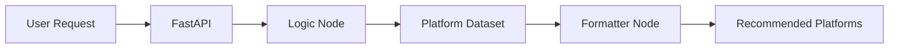

# Dall — AI-Powered Charity Advisor

Dall is an AI-powered assistant designed to help users discover trusted and official charitable platforms in Saudi Arabia.

The system analyzes each user’s intent and recommends the most relevant platform—such as Ehsan, Tabaraa, Shefaa, and others—using a structured and reliable data source.

## Features

- Understands user requests in Arabic and the Saudi dialect.
- Classifies requests into relevant charitable categories.
- Recommends trusted charitable platforms in Saudi Arabia.
- Applies strict filtering to prevent irrelevant recommendations.
- Generates clear and user-friendly responses.
- Uses a lightweight retrieval approach without requiring a vector database.
- Provides a simple and responsive web interface.

## Tech Stack

| Component | Technology | Purpose |
|---|---|---|
| Backend | FastAPI, Python | Provides a fast and reliable API |
| AI Orchestration | LangGraph | Manages the agent workflow using nodes and edges |
| Language Model | Llama 3 via Groq | Processes natural language and understands Saudi Arabic |
| Data Retrieval | Full-Scan Retrieval | Searches the structured dataset directly |
| Data Source | JSON | Stores charitable platform information |
| Frontend | HTML, CSS, JavaScript | Provides the user interface |

## System Architecture

Dall processes each user request through two main workflow nodes:

### Logic Node

The Logic Node analyzes the request, identifies the user’s intent, and classifies it into an appropriate category, such as:

- Medical assistance
- Housing support
- Financial assistance
- Volunteering opportunities
- Charitable projects

It then applies strict filtering rules to return only relevant and trusted platforms.

### Formatter Node

The Formatter Node converts the processed results into a clear and user-friendly response. Recommendations are presented in a natural and approachable Saudi Arabic tone.

## Workflow



1. The user submits a request through the web interface.
2. FastAPI sends the request to the LangGraph workflow.
3. The Logic Node detects the user’s intent and category.
4. The system scans `platforms.json` and filters the available platforms.
5. The Formatter Node generates the final response.
6. The recommended charitable platforms are displayed to the user.

## Project Structure

```text
Dall-AI-Agent/
├── data/
│   └── platforms.json      # Charitable platforms and services dataset
├── frontend-dall/
│   ├── index.html          # Frontend user interface
│   └── ...
├── api.py                  # API layer connecting the frontend to the AI logic
├── nodes.py                # Core processing and AI workflow nodes
├── graph.py                # LangGraph workflow definition
└── requirements.txt        # Python dependencies
```

## Getting Started

### Prerequisites

Before running the project, make sure you have:

- Python 3.10 or later
- A Groq API key
- Git

### Installation

Clone the repository:

```bash
git clone https://github.com/USERNAME/Dall-AI-Agent.git
cd Dall-AI-Agent
```

Create and activate a virtual environment:

```bash
python -m venv .venv
```

On Windows:

```bash
.venv\Scripts\activate
```

On macOS or Linux:

```bash
source .venv/bin/activate
```

Install the required dependencies:

```bash
pip install -r requirements.txt
```

### Environment Variables

Create a `.env` file in the project root:

```env
GROQ_API_KEY=your_groq_api_key
```

> Never commit API keys or the `.env` file to the repository.

### Running the Application

Start the FastAPI server:

```bash
uvicorn api:app --reload
```

Then open the frontend interface in your browser.

The API documentation is available at:

```text
http://127.0.0.1:8000/docs
```

## Data Source

The `platforms.json` file contains information about supported charitable platforms and their services.

Dall uses a full-scan retrieval approach to evaluate this dataset directly. This keeps the architecture simple and avoids the additional complexity of a vector database.

## API

The backend is built with FastAPI. Once the server is running, interactive API documentation can be accessed through Swagger UI:

```text
http://127.0.0.1:8000/docs
```

## Roadmap

- Expand the database of supported charitable platforms.
- Improve intent classification accuracy.
- Add automated testing.
- Support additional Arabic dialects.
- Add conversation history and contextual recommendations.
- Deploy the application to a production environment.


## Author

**Saud Alatani**

Artificial Intelligence Engineer
